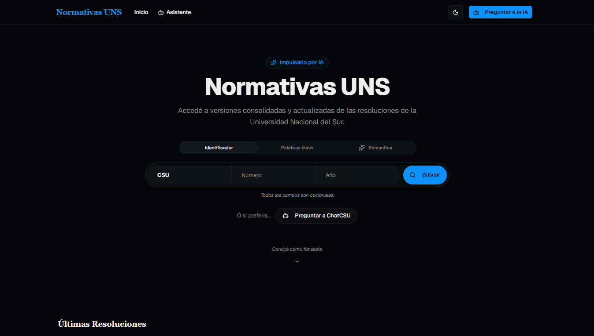
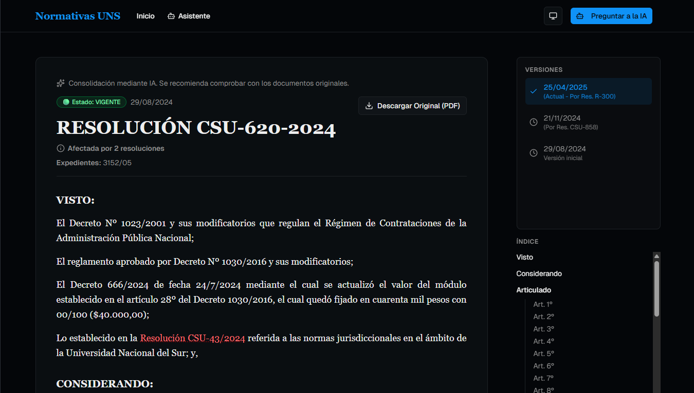
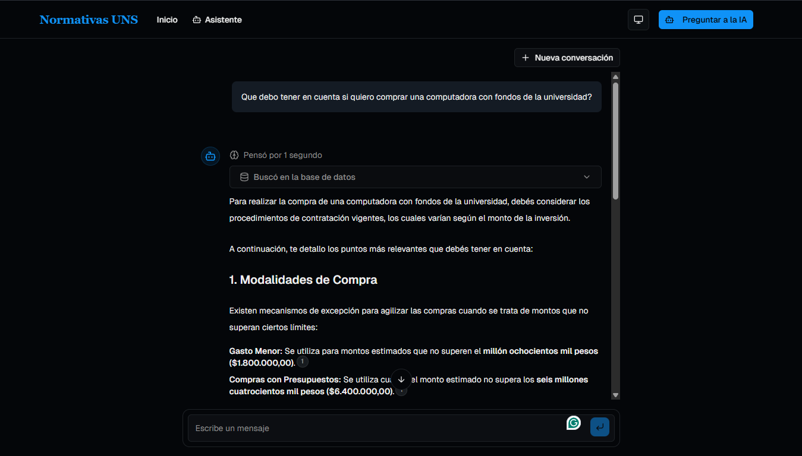
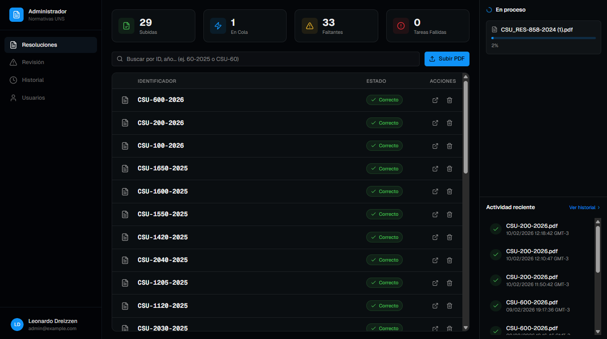
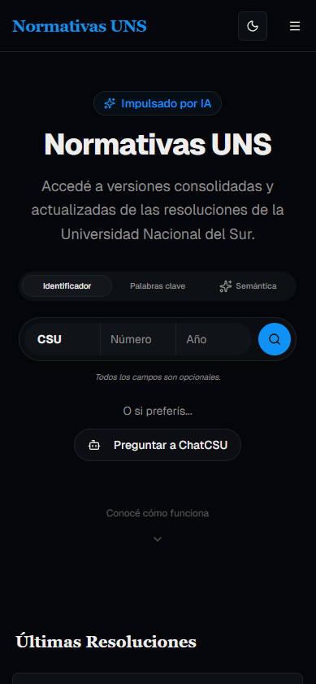
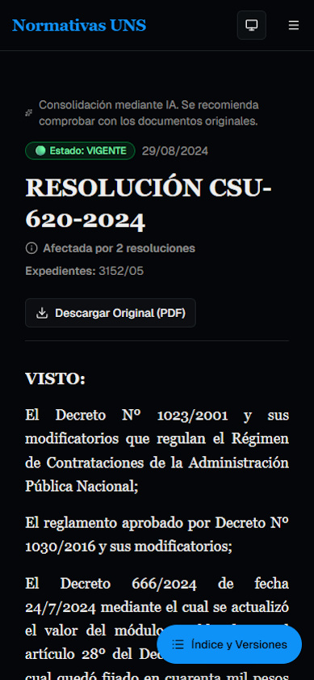
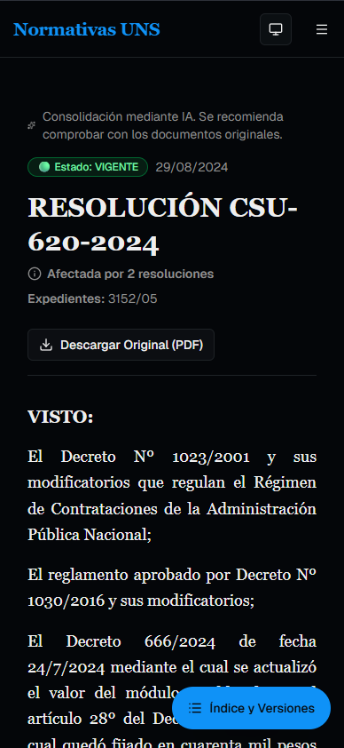
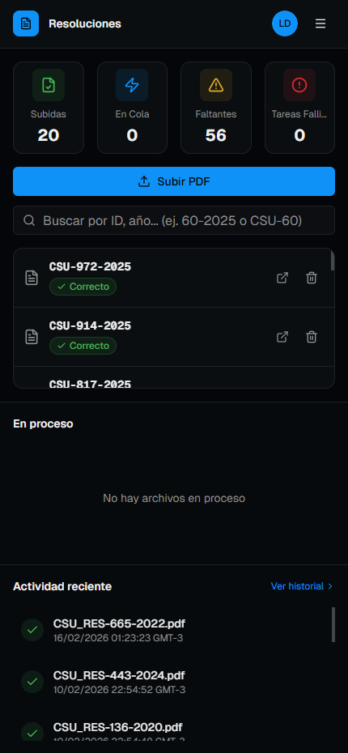
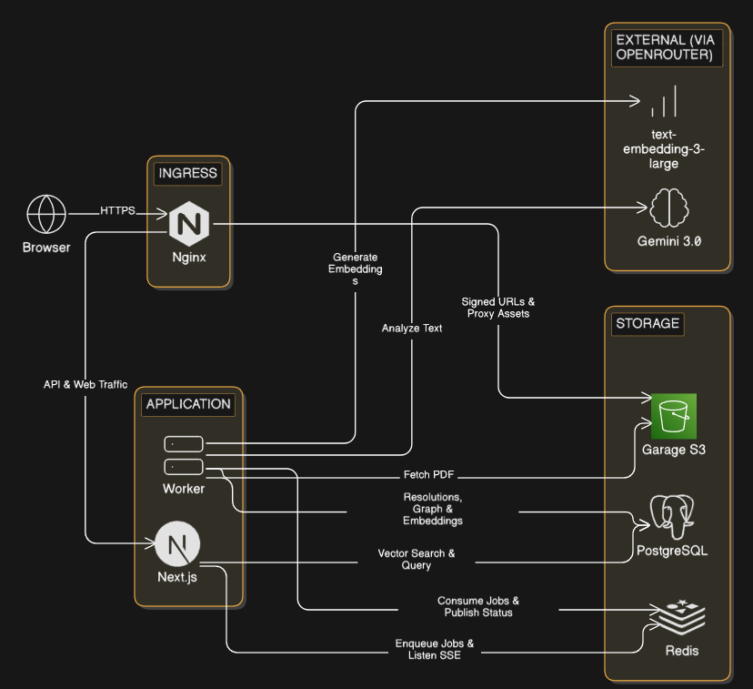

<div align="center">
  <a href="https://normativas.leodreizzen.com">
      
  </a>
  <h1>Normativas UNS</h1>
</div>

AI powered consolidation and version control system for legal documents, with web and chat interface.

**[🔗 Live Demo](https://normativas.leodreizzen.com/)**

## Table of Contents
- [Screenshots](#screenshots)
- [About The Project](#about-the-project)
- [Key features](#key-features)
- [How It Works](#how-it-works)
    - [Architecture](#architecture)
    - [Main Workflow](#main-workflow)
- [Tech Stack](#tech-stack)
- [Getting Started](#getting-started)
    - [Prerequisites](#prerequisites)
    - [Project Setup](#project-setup)
    - [Commands](#commands)
    - [Development URLs](#development-urls)
- [Contact](#contact)


## Screenshots
  
  
  
  

<br>

<details>
  <summary><strong>📱Mobile version</strong></summary>
  
  
  
  
</details>


## About The Project

Normativas UNS is a full-stack web application developed as my graduation project in Information Systems Engineering. It allows users to search, view and chat with the regulations of the Universidad Nacional del Sur. Users can find the consolidated version of the regulations, as well as the history of changes, and ask questions about them. Administrators simply upload PDF files, and the system automatically handles versioning and consolidation.

## Key Features
- **AI Powered document consolidation**: Using a combination of LLMs and graph algorithms to consolidate legal documents.
- **Version control**: All versions of the regulations are visible, allowing users to see the history of changes
- **Admin dashboard**: For managing the regulations. Uploading a PDF is enough to create versions of all affected documents.
- **Real-time Updates**: Using SSE to automatically update the dashboard as documents are processed.
- **Comprehensive search options**: Users can search by document id, keywords, or via semantic search.
- **Chat interface With Guardrails**: Users can ask questions about the regulations and get answers in natural language. The chatbot uses the consolidated versions, and has guardrails to prevent abuse.
- **Fully Responsive Design**: Works on mobile, tablet and desktop.
- **Dockerized**: The application is fully dockerized, both for local development and production. This allows for easy deployment and scaling.
- **CI/CD**: Automated linting and deployment.

## How It Works
### Architecture
<div align="center">
  
</div>

### Main Workflow
1. The administrator uploads a PDF file of a regulation.
2. An LLM extracts and analyzes the text, identifying its components, and the modifications it introduces.
3. When a user searches for a regulation, the system gets all relevant documents and resolves the validity graph to get the consolidated version.
4. Users can navigate through the different versions of the regulations, getting the consolidated version at any point in time. The chatbot uses the latest consolidated version.

## Tech Stack
- **Main Framework**: Next.js
- **Job queue**: BullMQ
- **Database**: PostgreSQL with Pgvector
- **ORM**: Prisma
- **Pubsub & Message Queue**: Redis
- **Authentication**: Better Auth
- **UI & Styling:** Shadcn UI, Tailwind CSS
- **Media Storage**: Garage (S3-compatible file storage)
- **AI**: Gemini 3.0 Flash, text-embedding-3-large and gpt-oss-safeguard-20b (through OpenRouter), OpenAI SDK, Vercel AI SDK
- **Forms & validation**: React Hook Form, Zod
- **Containerization**: Docker, Docker Compose
- **Reverse Proxy**: Nginx
- **CI/CD**: GitHub Actions

## Getting started
### Prerequisites
Prerequisites:
 - Docker
 - dotenvx (for secure .env file management)


### Project Setup
For Windows development, it is recommended to use WSL2 with a Linux distribution, and clone the repository inside it. This allows to use file watching instead of polling.

1. Clone this repository
2. Install precommit hook:
``` bash
    dotenvx ext precommit --install
```
3. Create a .env.keys file in the root directory and add your encryption key (use the `.env.keys.example` template)
4. Decrypt the .env file:  

Linux or MacOS:
``` bash
    dotenvx decrypt -f .env.development --stdout >.env
``` 
Windows (PowerShell):
``` powershell
   dotenvx decrypt -f .env.development --stdout | Set-Content .env -Encoding UTF8
```

5. If using windows (outside of WSL), set `POLLING=true` in the .env file

6. Start the Docker containers:
``` bash
    docker compose -f compose.dev.yaml up -d --build
```

After changing the .env.development file, run:
``` bash
    dotenvx encrypt -f .env.development
```

### Development URLs
Main server: http://localhost:8080 (through nginx, needed for assets to work properly)  
Direct connection to web server: http://localhost:3000  
Prisma studio: http://localhost:5555

### Commands
To run commands inside a container (e.g. `worker`, `web`) , use:
``` bash
    docker compose exec <container> <command>
```

To create a migration, use:
``` bash
    docker compose -f compose.dev.yaml run --rm -w /app/packages/db dev-init pnpm exec prisma migrate dev
```

## Contact

Leonardo Dreizzen - [GitHub](https://github.com/leodreizzen) - [LinkedIn](https://www.linkedin.com/in/leonardo-dreizzen/)